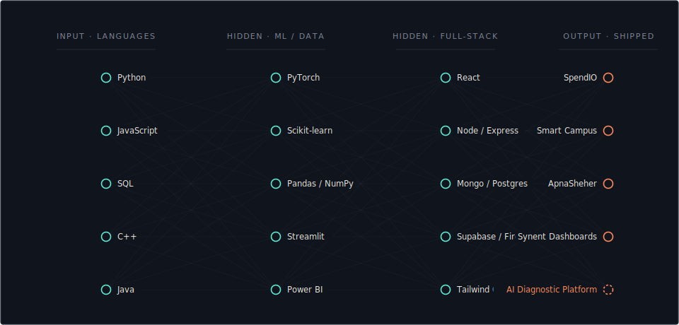

<div align="center">

</div>

<br/>

<div align="center">

</div>


## Architecture

<div align="center">

</div>

Four layers, roughly in the order they were picked up: languages in, ML/data tooling and full-stack tooling as the hidden layers, shipped systems out. Every project in the output layer drew on nodes from both hidden layers at once — none of them are pure-ML or pure-web.


## Training Log

<div align="center">

</div>

Loss here stands in for inexperience. `train_loss` tracks raw skill acquisition; `val_loss` tracks whether it held up outside a classroom — internships, shipped projects, real users. The gap between the two curves has been closing.

| checkpoint | what happened |
|:---:|---|
| `01` | Foundations — IBM and NPTEL certifications in Python for data science |
| `02` | SpendIO and Apna Seher shipped — first full-stack projects in production |
| `03` | 3Skill internship · Smart Campus Workflow Hub built |
| `04` | PyTorch fluency refresh (training loops, AMP, DDP) · exam cycle |
| `05` | Synent Technologies internship — 6 tasks shipped, dashboard deployed |
| `06` | Physical AI / robotics research track started |
| `07` | **Now** — Integrated AI Diagnostic Platform in progress |


## Training Data

*(certifications — the curated corpus this model was pretrained on)*

| Credential | Issuer | Core skills |
|---|---|---|
| Data Analysis with Python | IBM / Coursera · `Y5N037D1EF8X` | Pandas, NumPy, regression, visualization |
| Python for Data Science | NPTEL · `NPTEL25CS104S350100059` | Python fundamentals, exploratory data analysis |


## Intended Use

**Primary task — Integrated AI Diagnostic Platform for Medical X-Rays and Crop Pathology**
Two independent PyTorch models — pneumonia detection from chest X-rays, crop disease classification from leaf imagery — served behind a single shared web interface. The constraint that shapes every design decision: training and inference both have to fit inside 6GB of VRAM on an RTX 4050, which means mixed-precision training and deliberate batch-size tuning aren't optional.

**Shipped and reachable**
The Synent Technologies internship work is live — data cleaning, EDA, and dashboarding across six tasks, including a [deployed Streamlit app](https://synent-task04-csvtodahboard-aeleesbhuva.streamlit.app/) for CSV-to-dashboard conversion.


## Evaluation

*(external benchmarks, pulled live)*

<div align="center">


</div>


## Limitations & Future Work

- **Physical AI / robotics** — mid-roadmap on a self-directed track through transformers → diffusion models → papers (Diffusion Policy, RT-2, π0). Deeper here than in most third-year coursework, but still early.
- **Production ops** — stronger on the modeling and data side than on deployment infrastructure at scale; actively being corrected via the diagnostic platform's deployment work.
- **Known bias** — trained mostly on self-directed and internship projects rather than large team codebases; seeking that experience next.


## Citation

If you'd like to reach out, cite as:

```bibtex
@person{bhuva_aelees,
  title      = {Aelees Bhuva},
  role       = {Data Science Intern, Synent Technologies},
  education  = {B.Tech Computer Engineering, CHARUSAT University},
  github     = {https://github.com/Aelees0807},
  linkedin   = {https://linkedin.com/in/aelees-bhuva},
  email      = {aelees07@gmail.com},
  note       = {Open to interesting problems in ML, robotics, and full-stack systems}
}
```

<br/>

<div align="center">

</div>
