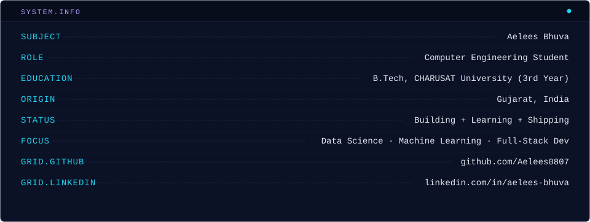
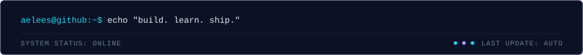

<div align="center">

</div>

<br/>

<div align="center">

</div>

<br/>

## ABOUT.ME / CURRENT.MISSION

Third-year Computer Engineering student at CHARUSAT, spending most of my time moving between full-stack builds and data/ML work. I like taking a rough idea — an academic workflow, an expense tracker, a diagnostic tool — and getting it to a state where someone can actually open it and use it, not just read about it in a report.

Right now that means building an image-classification platform in PyTorch, picking away at a DSA sheet in the evenings, and getting steadily more comfortable on the data-science side — pandas, scikit-learn, and enough statistics to know when a model's results actually mean something.

<br/>

## TECH.STACK

**Languages**
<br/>


**Frontend**
<br/>


**Backend**
<br/>


**Data / AI**
<br/>

<br/>
<sub>+ Pandas · NumPy · Matplotlib · Power BI</sub>

**Database**
<br/>


**Tools**
<br/>


<br/>

## FEATURED.PROJECTS

| PROJECT | DESCRIPTION | STACK | STATUS | REPO |
|---|---|---|---|---|
| **DiagnoVision** | Chest X-ray image classifier with Grad-CAM visualization | EfficientNet-B0 · PyTorch · Streamlit | `IN DEVELOPMENT` | private for now |
| **Smart Campus Workflow Hub** | Role-based academic management system with row-level security | React 19 · Node.js · Express · Supabase/PostgreSQL · Jest | `PUBLIC` | [Smart_Campus](https://github.com/Aelees0807/Smart_Campus) |
| **SpendIO** | Expense tracker | React · Node.js · MongoDB | `PUBLIC` | [SpendIO](https://github.com/Aelees0807/SpendIO) |
| **ApnaSheher** | Hackathon project — city services platform | React · Firebase | `PUBLIC` | [ApnaSheher](https://github.com/Aelees0807/ApnaSheher) |

<sub>Full list of repositories → [github.com/Aelees0807?tab=repositories](https://github.com/Aelees0807?tab=repositories)</sub>

<br/>

## GITHUB.TELEMETRY

<div align="center">


</div>

<br/>

## CONTRIBUTION.ACTIVITY

<div align="center">

</div>

<div align="center">

</div>

<br/>

## CURRENTLY.BUILDING

```
CURRENT.PROCESSES

[RUNNING]
→ DiagnoVision — chest X-ray classifier (PyTorch, Streamlit)

[EXPLORING]
→ Machine Learning
→ Data Science
→ Applied AI

[IMPROVING]
→ DSA
→ Software engineering fundamentals

[SHIPPING]
→ Personal projects
→ Portfolio site
```

<br/>

## LEARNING.PROTOCOL

```
NOW
→ Full-Stack Development
→ DSA
→ Data Science

NEXT
→ Machine Learning
→ Applied AI
→ Advanced Backend Development

LATER
→ System Design
→ Cloud
→ DevOps
→ Open Source
```

<br/>

## CONNECT.GRID

| | |
|---|---|
| **GRID.GITHUB** | [github.com/Aelees0807](https://github.com/Aelees0807) |
| **GRID.LINKEDIN** | [linkedin.com/in/aelees-bhuva](https://www.linkedin.com/in/aelees-bhuva/) |
| **GRID.EMAIL** | [aelees07@gmail.com](mailto:aelees07@gmail.com) |

<br/>

<div align="center">

</div>
